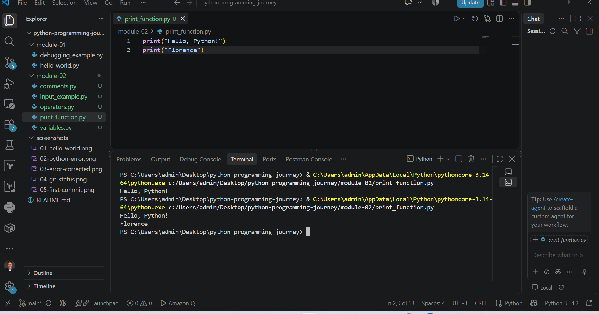
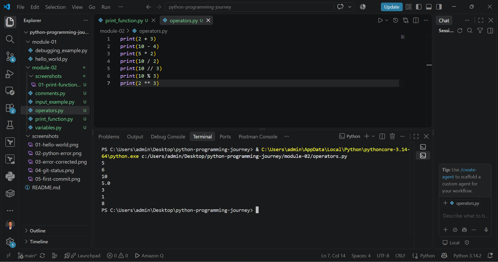
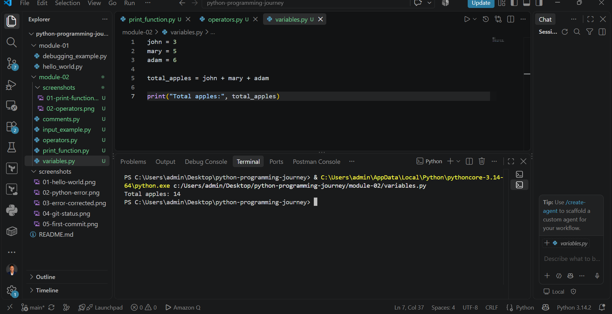
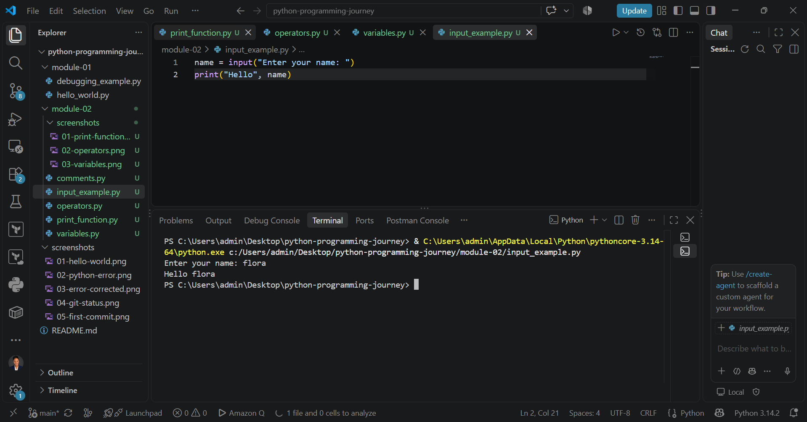

# Python Programming Journey - Module 2

## Overview

This module helped me move from the basic introduction to Python into writing and running simple Python programs.

Through the weekly discussion sessions, personal study, and hands-on practice in VS Code, I learned how to display output, perform calculations, store values in variables, receive user input, and understand some basic Python syntax.

## What I Learned

### 1. The `print()` Function

I learned that `print()` is used to display information on the screen.

Example:

```python
print("Hello, Python!")
print("Florence")
```

### 2. Python Operators

I practised using Python as a simple calculator with arithmetic operators.

```python
+   Addition
-   Subtraction
*   Multiplication
/   Division
//  Floor division
%   Modulus
**  Exponentiation
```

For example:

```python
print(2 + 3)
print(10 - 4)
print(5 * 2)
print(10 / 2)
print(10 // 3)
print(10 % 3)
print(2 ** 3)
```

This helped me understand how Python evaluates mathematical expressions.

### 3. Variables

I learned that variables are used to store values that can be used later in a program.

For example:

```python
john = 3
mary = 5
adam = 6

total_apples = john + mary + adam

print("Total apples:", total_apples)
```

The result was:

```text
Total apples: 14
```

This exercise helped me understand how values can be stored, combined, and displayed.

### 4. User Input

I also learned how to make a program interactive using the `input()` function.

```python
name = input("Enter your name: ")
print("Hello", name)
```

When I entered my name, Python used the information I provided and displayed a greeting.

I learned that `input()` receives information from the user and stores it for the program to use.

### 5. Comments

I learned that comments are used to explain Python code and make it easier for other people, and even myself, to understand later.

A Python comment begins with `#`.

Example:

```python
# This program displays a greeting
print("Hello")
```

### 6. Data and Type Conversion

I also learned that Python works with different types of data such as integers, floats, strings, and Boolean values.

Functions such as:

```python
int()
float()
str()
```

can be used to convert data from one type to another.

## Hands-on Practice

I practised the concepts using VS Code and created the following files:

- `print_function.py`
- `operators.py`
- `variables.py`
- `input_example.py`
- `comments.py`

I ran each program and checked the output in the VS Code terminal.

## Commands Used

Some of the commands I used while working on and documenting this module include:

| Command | What it does |
|---|---|
| `python print_function.py` | Runs the print function program |
| `python operators.py` | Runs the arithmetic operators program |
| `python variables.py` | Runs the variables program |
| `python input_example.py` | Runs the user input program |
| `git status` | Shows changes made in the repository |
| `git add .` | Adds the changed files to Git staging |
| `git commit -m "message"` | Saves the changes with a description |
| `git push` | Uploads the committed work to GitHub |

## Screenshots of My Practice

### Using the `print()` Function



### Working with Python Operators



### Working with Variables



### Using the `input()` Function



## Challenge

One challenge was remembering the purpose of the different operators and understanding how each one changes the result.

Working through the examples and checking the output in the terminal helped me understand them better.

I also learned that making mistakes and testing the code are important parts of learning Python.

## Key Takeaways

My main takeaway from Module 2 is that Python programs work by combining simple building blocks.

I can now:

- Display output using `print()`
- Perform basic calculations
- Store values using variables
- Receive information from a user
- Add comments to make code easier to understand
- Work with basic Python data types

Practising each concept in VS Code helped me understand the difference between simply reading about Python and actually writing working code.

## Module Status

Module 2 Completed.